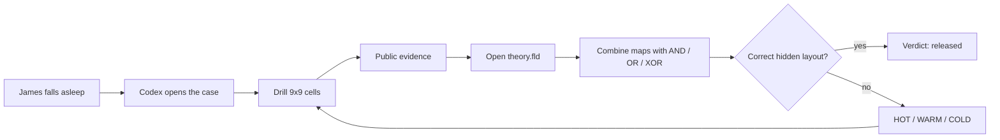

# No Free Lunch

A cursed browser board game about Boolean logic, hidden maps, and a student who fell asleep in the wrong proof. Frontend is React + Tailwind + shadcn; backend is Convex. Three play modes: local same-device, online room/random match, and vs The Assayer.

> **Agents (Codex-first):** [`AGENTS.md`](./AGENTS.md) · rules in [`.agents/rules/`](./.agents/rules/) · skills in [`.agents/skills/`](./.agents/skills/)

## Status

**Playable.** Engine + exact solver + local pass-and-play + **vs The Assayer** are live. Online lobbies and shared turn sync run through Convex with a **15-game capacity cap**.

```bash
npm install
npm run dev        # play at localhost:5173
npm test           # 18 engine/solver tests
npm run typecheck
```

## Judge Path

Seeded, reproducible links for a short review session:

| Try | Link | What to look for |
|-----|------|------------------|
| Quick game | `/?play=lunch&seed=JUDGES-1&vs=agent&ai=fair` | The Black Forest table, drill turns, Assayer narration, first-turn teaching prompts |
| Win ending | `/?play=lunch&seed=JUDGES-1&vs=agent&ending=win` | The narrative twist after beating the bot |
| Coin demo | `/?demo=coin&seat=red` | Teammate's 3D coin / sleep-feature experiment |

## How We Used Codex and GPT-5.6

| Tool | Where it appears | Why it matters |
|------|------------------|----------------|
| **Codex** | The project was developed with Codex as a coding partner: repo memory in [`AGENTS.md`](./AGENTS.md), durable rules in [`.agents/rules/game-rules.md`](./.agents/rules/game-rules.md), and reusable project skills in [`.agents/skills/`](./.agents/skills/). | Codex was not just a helper chat. It carried the product direction, design rules, game invariants, and implementation workflow across multiple UI/backend iterations. |
| **GPT-5.6** | The Assayer's live taunts are generated by GPT-5.6 through the OpenAI Responses API in [`convex/narrator.ts`](./convex/narrator.ts). The default model is `gpt-5.6-luna`; set `OPENAI_NARRATOR_MODEL=gpt-5.6-sol` on Convex to use Sol for a judging demo. | GPT-5.6 gives the boss a fresh horror-comedy voice while the exact solver still controls the facts, so the model can phrase the truth without inventing gameplay state. |
| **OpenAI API + Convex** | The browser sends only public solver facts to Convex; Convex calls OpenAI server-side with `OPENAI_API_KEY`; the client never sees the key. | This makes the AI feature demoable, secure enough for a hackathon, and resilient: if OpenAI is unavailable, deterministic narration keeps the game playable. |



## Hackathon Fit

| Criterion | What this demonstrates |
|-----------|------------------------|
| Technological implementation | A pure game engine, exact solver over Boolean map layouts, bitboard-style reasoning, Convex-backed rooms/matchmaking/online play, and Codex-readable project memory in `.agents/`. |
| Design | A complete product loop: intro, mode selection, playable table, case-file map UI, Assayer boss presence, audio atmosphere, endings, and replayable seeded demos. |
| Potential impact | A concrete learning toy for students and educators: Boolean logic, hypothesis spaces, information gain, and the No Free Lunch theorem become playable instead of abstract. |
| Quality of idea | Logic puzzle + competitive drilling + horror-comedy ritual. The AI opponent is not just a chatbot skin; it plays from exact public evidence and exposes its reasoning through the fiction. |

## Backend & the GPT-5.6-voiced Assayer

The Assayer's taunts are written live by GPT-5.6 through the OpenAI Responses API — but grounded so it
**cannot lie about the game**. The exact solver computes the facts (surviving
hypotheses, chosen move, mood); a Convex action (`convex/narrator.ts`) asks the
model only to *phrase* them. No key, no network, or a slow call → the game
silently falls back to deterministic lines. The game is fully playable either way.

**You do not need an OpenAI key to run or develop the game.** The GPT voice is
served by a shared Convex backend that holds the key server-side; the browser
never sees it. To light it up:

```bash
# One person, once — creates the shared cloud backend:
npx convex login                                   # browser, your Convex account
npx convex deploy                                  # prints https://<name>.convex.cloud
npx convex env set OPENAI_API_KEY <key> --prod     # key lives ONLY on the server
npx convex env set OPENAI_NARRATOR_MODEL gpt-5.6-luna --prod

# Everyone else (and the CI build) — just point at that URL:
echo 'VITE_CONVEX_URL=https://<name>.convex.cloud' >> .env.local
```

- The **key never goes in git** (`.env.local` is ignored) or the client bundle.
- `VITE_CONVEX_URL` is **not** secret — it's just the backend address.
- `OPENAI_NARRATOR_MODEL` is optional; the backend defaults to `gpt-5.6-luna`.
- Set a spend limit on the OpenAI project; if it's hit, the game falls back
  gracefully. Rotate the key after the event.

## README Visuals To Capture

Best submission assets, in order:

| Asset | Route | Why it helps |
|-------|-------|--------------|
| Hero still | `/` | Shows the cursed title, plus sign, forest mood, and creator polish immediately. |
| 10-second gameplay GIF | `/?play=lunch&seed=JUDGES-1&vs=agent&ai=fair` | Shows pin drilling, Assayer turn pacing, evidence, and the table in motion. |
| Case-file screenshot | Open `theory.fld` in the same run | Explains the AND / OR / XOR logic without needing a long paragraph. |
| Ending still | `/?play=lunch&seed=JUDGES-1&vs=agent&ending=win` | Proves the narrative has a payoff, not just atmosphere. |
| Coin feature clip | `/?demo=coin&seat=red` | Highlights the teammate's 3D experiment as a polished bonus. |

### Why the AI can't lie

The secret formula space is exactly enumerable (layout-space BFS over bitboards, deduped — thousands of boards, not millions of expressions). The Assayer maintains every hypothesis consistent with public evidence and narrates only those facts — the narration is derived from an exact solver, so it cannot hallucinate the game. See [convex/engine/solver.ts](convex/engine/solver.ts).

## Intended structure

```text
no-free-lunch/
├── AGENTS.md                      # Codex entrypoint (keep concise)
├── README.md                      # this file
├── docs/
│   ├── product-vision.md          # modes, product goals
│   ├── design-system.md           # theme, popups, motion
│   └── game-rules.md              # pointer → .agents/rules/game-rules.md
├── .agents/
│   ├── rules/                     # durable agent rules (canonical)
│   │   ├── game-rules.md
│   │   ├── project-vision.md
│   │   ├── frontend-design.md
│   │   └── convex-backend.md
│   └── skills/                    # Codex skills
│       ├── nfl-frontend/
│       ├── nfl-convex/
│       └── nfl-game-modes/
├── src/                           # React app (scaffold when building)
│   ├── components/
│   │   ├── ui/                    # shadcn primitives
│   │   └── game/                  # game-specific UI
│   ├── hooks/
│   ├── lib/
│   └── styles/
└── convex/                        # Convex schema + functions
    ├── schema.ts
    ├── games.ts
    ├── rooms.ts
    └── ...
```

## Stack

| Concern | Choice |
|---------|--------|
| Components | React |
| Styling | Tailwind CSS |
| UI kit | shadcn/ui |
| Backend / realtime | Convex |

## Design targets

- Modern, simplified UI
- **Dark blue** main theme
- Dialogs/popups with **Gaussian blur** backdrops
- Use popups when the flow needs modal focus
- Moderate animations on shadcn pieces
- Explicit loading states for async UI

Details: [`docs/design-system.md`](./docs/design-system.md).

## Game modes

1. **Local** — two players on the same device, alternating rounds
2. **Online** — join via shared room code, or random pair
3. **vs Agent** — human vs The Assayer, a solver-backed Codex boss with fair and merciless modes

Details: [`docs/product-vision.md`](./docs/product-vision.md).

## Agent setup (Codex)

| File / path | Purpose |
|-------------|---------|
| `AGENTS.md` | Auto-loaded by Codex; short durable rules |
| `.agents/rules/*` | Game rules + project/frontend/Convex rules |
| `.agents/skills/*` | Invokable skills (`$nfl-frontend`, etc.) |
| `docs/*` | Product vision & design system (plus pointers) |

Clone the repo on any machine — agents pick up the same vision from these committed files. **Do not use `.cursor/` for rules** — keep agent memory under `.agents/`.

### Useful skill triggers

- UI / theme / modals → `$nfl-frontend`
- Convex schema, rooms, matchmaking → `$nfl-convex`
- Mode selection and session model → `$nfl-game-modes`

## Development

```bash
cp .env.sample .env.local
npx convex dev          # writes CONVEX_DEPLOYMENT + VITE_CONVEX_URL into .env.local
npm run dev             # Vite
```

Never commit `.env` / `.env.local`. Keep secrets out of git; `.env.sample` is the template.

## GitHub Actions / secrets

Workflows live in [`.github/workflows/`](./.github/workflows/):

| Workflow | When | What |
|----------|------|------|
| `ci.yml` | PR + push | `npm test` + typecheck |
| `deploy.yml` | push to `main` | Convex production deploy + Vite build + **GitHub Pages** |

Public site: [https://bear-resort.github.io/no-free-lunch/](https://bear-resort.github.io/no-free-lunch/)

### Secret to add

In GitHub: **Settings → Secrets and variables → Actions → New repository secret**

| Name | Where to get it |
|------|-----------------|
| `CONVEX_DEPLOY_KEY` | [Convex Dashboard](https://dashboard.convex.dev) → your project → **Production** deployment → **Settings → Deploy Keys → Generate Production Deploy Key** (enable `deployment:deploy`) |

That single secret is enough for CI deploy. The action runs:

```bash
npx convex deploy --yes --cmd 'npm run build' --cmd-url-env-var-name VITE_CONVEX_URL
```

with `VITE_BASE=/no-free-lunch/` so asset paths work on project Pages, then uploads `dist/` via `actions/deploy-pages`.

Convex injects the **production** URL into the Vite build; you do **not** need a separate `VITE_CONVEX_URL` GitHub secret for this workflow.

Pages source should be **GitHub Actions** (Settings → Pages → Build and deployment).

## Game rules

Canonical: [`.agents/rules/game-rules.md`](./.agents/rules/game-rules.md).

## Next

1. Compress `public/audio/moon_ending.wav` to MP3/OGG before final deployment
2. Add `CONVEX_DEPLOY_KEY` in GitHub Actions secrets (if missing)
3. Push to `main` to run CI + Convex deploy + GitHub Pages
4. Open [https://bear-resort.github.io/no-free-lunch/](https://bear-resort.github.io/no-free-lunch/)
